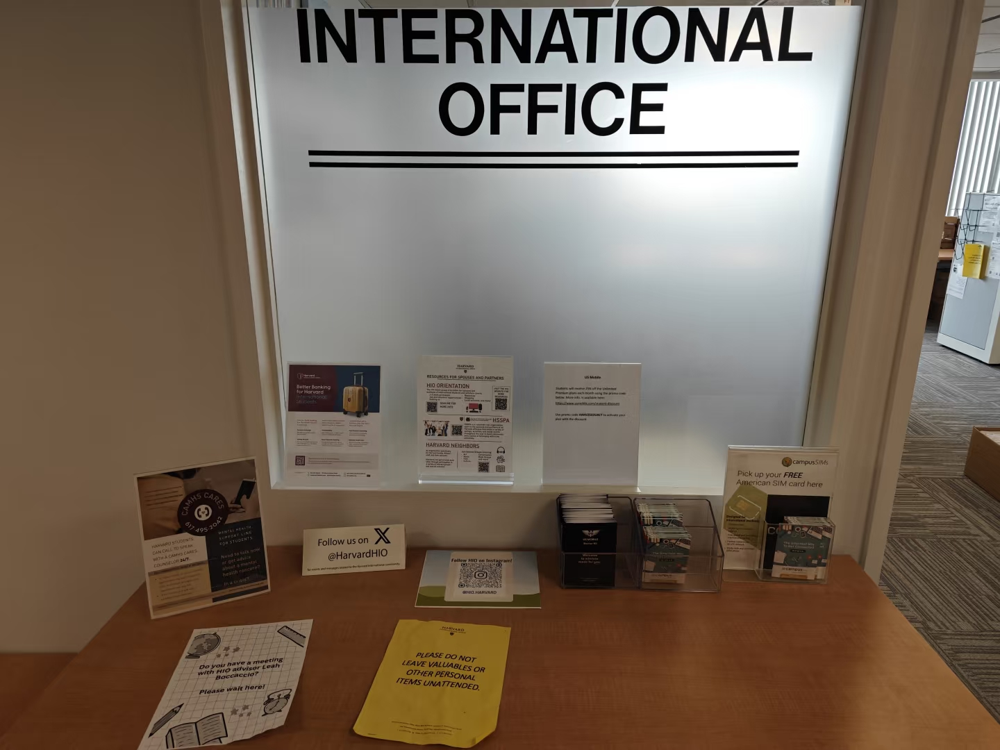
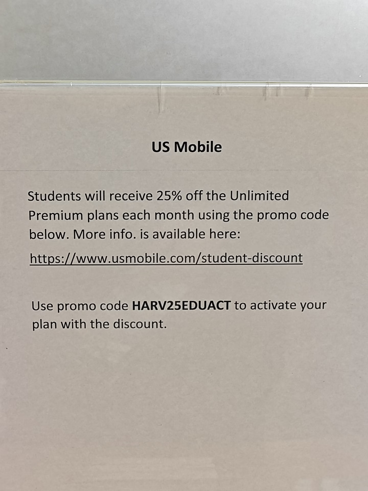

# 引言

哈佛大学国际办公室提供免费的实体电话卡，卡片自行上门领取，领取后需要自行开通运营商套餐以获得手机号和通讯服务。
## 一、领取地点

在 **Smith Campus Center 8 楼 HIO（Harvard International Office）办公室门口**领取，给楼下保安看护照即可上楼。

## 二、电话卡种类及套餐费用

现场有两种运营商的卡片：

**（1）US Mobile。** 哈佛免费提供 Starter Kit 套装，内含两张卡，分别连接至不同蜂窝网络运营商：Warp（Verizon）和 Dark Star（AT&T）。哈佛额外提供了官方的校园优惠码。
不限量套餐含税 $199 一年。US Mobile 自家活动的优惠力度大于哈佛校园优惠。具体为 Unlimited Starter 套餐全年 $199，含无限流量、无限短信，以及拨打中国的无限量国际通话。

**（2）Mint。**
不限量套餐宣称 $180 一年，实际马萨诸塞州含税约 $207 一年。不限量国际通话范围不包括中国。
## 三、使用体验（面向马萨诸塞州）

激活前需要先把手机 IMEI 发给客服，确认兼容性。我就是吃了兼容性的亏。

**Warp：** 使用 Verizon 网络。个人使用约 2 个月，日常体验良好，但只有 LTE 信号，没有 5G 信号。部分密闭空间信号不好，例如 Harvard Square 的 Bank of America 负一楼几乎没信号。

**Dark Star：** 使用 AT&T 网络。经同事手机测试，在哈佛大学 Cambridge 校区，Dark Star 信号标识只有两个格子。

**Light Speed：** 使用 T-Mobile 网络。因为我的手机使用 Warp 卡没有 5G 信号和 Wi-Fi Calling，于是和客服求证手机兼容性，被告知和 Warp 不兼容。遂更换成 Light Speed（需向客服申请免费邮寄新卡）。更换后，立马有了 5G+ 和 HD 通话信号，而且手机多了 Wi-Fi Calling 功能。

根据官网细则，Light Speed 在 Unlimited Starter 套餐下为 QCI 7，另外两张卡为 QCI 9。不同运营商的 QCI 数字不宜直接横向比较，但就我的手机和使用地点而言，Light Speed 的实际体验最好。比较鸡贼的是，US Mobile 的 Starter Kit 默认并不提供 Light Speed 实体卡。

## 四、后记

个人比较推荐US Mobile，可以点这里直接到[官网](https://www.usmobile.com/referrals?referrer=27017230&name=LITAO&utm_campaign=referrals_2026)，如果用我的推荐码，你我都可以额外领 **$30**现金：**27017230**。最终年费套餐价格将低至170美元。**$30**发放方式：账单金额累计满 $100（也即大约 6 个月后），系统会自动下发虚拟银行卡，可绑定电子钱包消费。推荐奖励规则可能调整，以 US Mobile 当时的活动条款为准。
